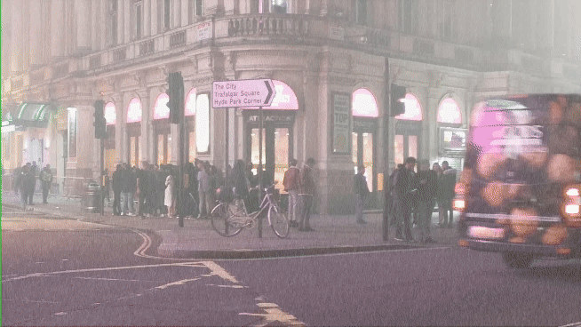

[](https://paperswithcode.com/sota/deblurring-on-beam-splitter-deblurring-bsd?p=learning-truncated-causal-history-model-for)
[](https://paperswithcode.com/sota/rain-removal-on-nighrain?p=learning-truncated-causal-history-model-for)
[](https://paperswithcode.com/sota/snow-removal-on-rvsd?p=learning-truncated-causal-history-model-for)
[](https://paperswithcode.com/sota/video-deraining-on-vrds?p=learning-truncated-causal-history-model-for)
[](https://paperswithcode.com/sota/video-denoising-on-set8-sigma50?p=learning-truncated-causal-history-model-for)
[](https://paperswithcode.com/sota/deblurring-on-gopro?p=learning-truncated-causal-history-model-for)


#  **Turtle: Learning Truncated Causal History Model for Video Restoration [NeurIPS'2024]**

[📄 arxiv](https://arxiv.org/abs/2410.03936)
**|** 
[🌐 Website](https://kjanjua26.github.io/turtle/)

The official PyTorch implementation for **Learning Truncated Causal History Model for Video Restoration**, accepted to NeurIPS 2024. 

- Turtle achieves state-of-the-art results on multiple video restoration benchmarks, offering superior computational efficiency and enhanced restoration quality 🔥🔥🔥.
- **🛠️💡Model Forge**: Easily design your own architecture by modifying the option file.
    - You have the flexibility to choose from various types of layers—such as channel attention, simple channel attention, CHM, FHR, or custom blocks—as well as different types of feed-forward layers.
    - This setup allows you to create custom networks and experiment with layer and feed-forward configurations to suit your needs. 
- If you like this project, please give us a ⭐ on Github!🚀 

<p align="center">
  
  
</p>

<p align="center">
  
  
</p>

### 🔥 📰 News 🔥
- Oct. 10, 2024: The paper is now available on [arxiv](http://export.arxiv.org/abs/2410.03936) along with the code and pretrained models.
- Sept 25, 2024: Turtle is accepted to NeurIPS'2024.

  
## Table of Contents
1. [Installation](#installation)
2. [Trained Models](#trained-models)
3. [Dataset Preparation](#1-dataset-preparation)
4. [Training](#2-training)
5. [Evaluation](#3-evaluation)
    - [Testing the Model](#31-testing-the-model)
    - [Inference on Given Videos](#32-inference-on-given-videos)
6. [Model Complexity and Inference Speed](#4-model-complexity-and-inference-speed)
7. [Acknowledgments](#5-Acknowledgments)
8. [Citation](#6-citation)

   
## Installation
This implementation is based on [BasicSR](https://github.com/xinntao/BasicSR) which is an open-source toolbox for image/video restoration tasks.

```python
python 3.9.5
pytorch 1.11.0
cuda 11.3
```

```
pip install -r requirements.txt
python setup.py develop --no_cuda_ext
```

## Trained Models

You can download our trained models from Google Drive: [Trained Models](https://drive.google.com/drive/folders/1Mur4IboaNgEW5qyynTIHq8CSAGtyykrA?usp=sharing)


## 1. Dataset Preparation
To obtain the datasets, follow the official instructions provided by each dataset's provider and download them into the dataset folder. You can download the datasets for each of the task from the following links (official sources reported by their respective authors).

1. Desnowing: [RSVD](https://haoyuchen.com/VideoDesnowing)
2. Raindrops and Rainstreaks Removal: [VRDS](https://hkustgz-my.sharepoint.com/personal/hwu375_connect_hkust-gz_edu_cn/_layouts/15/onedrive.aspx?id=%2Fpersonal%2Fhwu375%5Fconnect%5Fhkust%2Dgz%5Fedu%5Fcn%2FDocuments%2FVRDS&ga=1)
3. Night Deraining: [NightRain](https://drive.google.com/drive/folders/1zsW1D8Wtj_0GH1OOHSL7dwR_MIkZ8-zp?usp=sharing)
4. Synthetic Deblurring: [GoPro](https://seungjunnah.github.io/Datasets/gopro)
5. Real-World Deblurring: [BSD3ms-24ms](https://drive.google.com/drive/folders/1LKLCE_RqPF5chqWgmh3pj7cg-t9KM2Hd?usp=sharing)
6. Denoising: [DAVIS](https://github.com/m-tassano/fastdvdnet?tab=readme-ov-file) | [Set8](https://drive.google.com/drive/folders/11chLkbcX-oKGLOLONuDpXZM2-vujn_KD?usp=sharing)
7. Real-World Super Resolution: [MVSR](https://github.com/HITRainer/EAVSR?tab=readme-ov-file)

The directory structure, including the ground truth ('gt') for reference frames and 'blur' for degraded images, should be organized as follows:

```bash
./datasets/
└── Dataset_name/
    ├── train/
    └── test/
        ├── blur
           ├── video_1
           │   ├── Fame1
           │   ....
           └── video_n
           │   ├── Fame1
           │   ....
        └── gt
           ├── video_1
           │   ├── Fame1
           │   ....
           └── video_n
           │   ├── Fame1
           │   ....
```

## 2. Training
To train the model, make sure you select the appropriate data loader in the `train.py`. There are two options as follows.

1. For deblurring, denoising, deraining, etc. keep the following import line, and comment the superresolution one.
`from basicsr.data.video_image_dataset import VideoImageDataset` 

2. For superresolution, keep the following import line, and comment the previous one.
`from basicsr.data.video_super_image_dataset import VideoSuperImageDataset as VideoImageDataset`

```
python -m torch.distributed.launch --nproc_per_node=8 --master_port=8080 basicsr/train.py -opt /options/option_file_name.yml --launcher pytorch
```

## 3. Evaluation

The pretrained models can be downloaded from the [GDrive link](https://drive.google.com/drive/folders/1Mur4IboaNgEW5qyynTIHq8CSAGtyykrA?usp=sharing).

### 3.1 Testing the model
To evaluate the pre-trained model use this command:

```
python inference.py
```

Adjust the function parameters in the Python file according to each task requirements:
1. `config`: Specify the path to the option file.
2. `model_path`: Provide the location of pre-trained model.
3. `dataset_name`: Select the dataset you are using ("RSVD", "GoPro", "SR", "NightRain", "DVD", "Set8").
4. `task_name`: Choose the restoration task ("Desnowing", "Deblurring", "SR", "Deraining", "Denoising").
5. `model_type`: Indicate the model type ("t0", "t1", "SR").
6. `save_image`: Set to `True` if you want to save the output images; provide the output path in `image_out_path`.
7. `do_patches`: Enable if processing images in patches; adjust `tile` and `tile_overlap` as needed, default values are 320 and 128.
8. `y_channel_PSNR`: Enable if need to calculate PSNR/SSIM in Y Channel, default is set to False.


### 3.2 Running Turtle on Custom Videos:

This pipeline processes a video by extracting frames and running a pre-trained model for tasks like desnowing:

#### Step 1: Extract Frames from Video

1. Edit `video_to_frames.py`:
   - Set the `video_path` to your input video file.
   - Set the `output_folder` to save extracted frames.

2. Run the script:
   ```bash
   python video_to_frames.py
   ```

#### Step 2: Run Model Inference

1. Edit `inference_no_ground_truth.py`:
   - Set paths for `config`, `model_path`, `data_dir` (extracted frames), and `image_out_path` (output frames).
   
2. Run the script:
   ```bash
   python inference_no_ground_truth.py
   ```


## 4. Model complexity and inference speed
* To get the parameter count, MAC, and inference speed use this command:
```
python basicsr/models/archs/turtle_arch.py
```

### Contributions 📝📝

We invite the community to contribute to extending **TURTLE** to other low-level vision tasks. Below is a list of specific areas where contributions could be highly valuable if the models are open-sourced. If you have other suggestions or requests, please feel free to open an issue.

1. **Training TURTLE for Synthetic Super-Resolution Tasks**  
   - **Bicubic (BI) Degradation**: Train on REDS, Vimeo90K and evaluate on REDSS4, Vimeo90K-T.  
   - **Blur-Downsampling (BD) Degradation**: Train on Vimeo90K and evaluate on Vimeo90K-T, Vid4, UDM10.

For more information on dataset selection and data preparation, please refer to Section 4.3 in this [paper](https://arxiv.org/pdf/2206.02146).


### Acknowledgments

This codebase borrows from the following [BasicSR](https://github.com/xinntao/BasicSR) and [ShiftNet](https://github.com/dasongli1/Shift-Net) repositories.

### Citation

If you find our work useful, please consider citing our paper in your research.


```
@inproceedings{ghasemabadilearning,
  title={Learning Truncated Causal History Model for Video Restoration},
  author={Ghasemabadi, Amirhosein and Janjua, Muhammad Kamran and Salameh, Mohammad and Niu, Di},
  booktitle={The Thirty-eighth Annual Conference on Neural Information Processing Systems}
}
```
